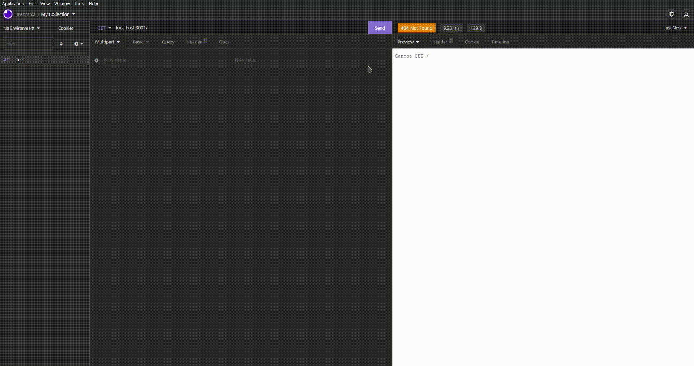
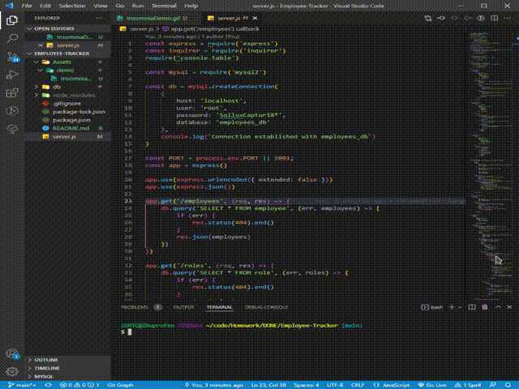

<!-- proj name -->

# Employee-Tracker

<!-- project shields -->

<!-- toc -->

## Table of Contents

- [Employee-Tracker](#title)
- [About Employee-Tracker](#about-proj)
- [Getting Started](#getting-started)
- [Usage](#Usage)
- [Testing](#testing)
- [Contributing](#contributing)
- [License](#license)
- [Contact Me](#contact-me)

<!-- about project -->

## About Employee-Tracker

Employee Tracker is a simple to use command line application to manage your employees. Employee Tracker features what you need to manage your employee database quickly and efficiently!

<!-- Getting Started -->

## Getting Started
This is how you can get started using Employee-Tracker locally. Begin by following these instructions.
### Installation

To install Employee Database, simply clone the GitHub repository. Extract the folder contents to wherever you desire and open a terminal window within the new directory. In the terminal run `npm i` to install all npm requirements. Voila! You've successfully installed Employee Tracker and it is now ready to use!

<!-- Usage -->

## Usage

To use Employee Tracker simply follow the instructions. Once completed, open a terminal window, or use the previously opened window from the [installation](#getting-started) instructions, and insert the following command: `node server.js` to begin the management application. A user can select view employees to simply view stored employees or can edit values such as employees, roles and departments.

<!-- Testing -->

## Testing
Insomnia Demonstration

 
Inquirer Demonstration

To test Employee Tracker follow the [installation](#getting-started) and [usage](#Usage) instructions.

<!-- Contributing -->

## Contributing

undefined

script should autogenerate this text depending on user choice

<!-- License -->

## License

<!-- Contact Me -->

## Contact Me
- [zortro](https://github.com/zortro)
- ben.d.dominguez@gmail.com

This readme file was generated using [ReadMe Generator](https://github.com/zortro/readme-generator/)